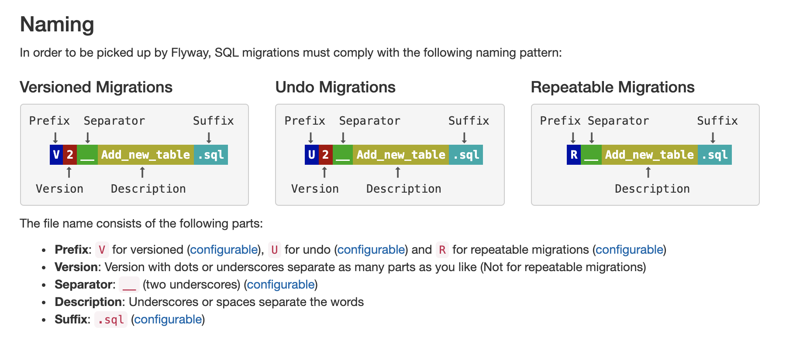

# Flyway Tutorial

**Flyway**, database migrations made easy
[https://flywaydb.org](https://flywaydb.org)

## Introduction

Let's pretend that we are working on an application called `Cthulhu`. We decided that we are not going to use an existing framework - so we don't get the luxury of any database migration system that might come with one. This is where [Flyway]((https://flywaydb.org)) comes in handy. It's language agnostic.

## Setting up

We are going to be creating a simple migration on a postgres database. Our database will have the same name as our application: `cthulhu`

[Homebrew](https://brew.sh/) makes setting things up pretty easy.

In your terminal:

```
brew install postgresql
brew install flyway

createdb cthulhu -U $USER
```

### Things to note

- You need to create a database before using Flyway.
- Setting up a postgres database is outside the scope of this tutorial. `createdb cthulhu -U $USER` _should_ be good enough.


## Recommended directory structure

The root folder of our project also matches the project name: `cthulhu`

```
cthulhu
cthulhu/flyway
cthulhu/flyway/sql     
cthulhu/flyway/sql/up
cthulhu/flyway/sql/down
```

### Things to note

* Since the free version of Flyway does not include rollbacks - most people don't need or use the `down` folder. 
* How you structure your project's directories is competely up to you!

## Migration files


### Versioning, conventions, and content

[Dealing with versioned migrations](https://flywaydb.org/documentation/migrations#versioned-migrations); from the official docs.




**Example migration**

Filename: `cthulhu/flyway/sql/up/V1__Create_users_table.sql`

```
CREATE TABLE IF NOT EXISTS users (
  id           UUID PRIMARY KEY NOT NULL,
  firstname    TEXT NOT NULL,
  lastname     TEXT NOT NULL,
  created_at   TIMESTAMP WITH TIME ZONE NOT NULL DEFAULT NOW(),
  updated_at   TIMESTAMP WITH TIME ZONE
);
```

**Example rollback**

Filename: `cthulhu/flyway/sql/down/U1__Create_users_table.sql`

```
DROP TABLE IF EXISTS users;
```

### Things to note

* The SQL in the down file _must_ completely undo whatever the up migration performed on the database. 

## Running a migration

From the root of the `cthulhu` project, run the following command:

```
flyway \
 -user=$USER \
 -password="" \
 -url=jdbc:postgresql://localhost/cthulhu \
 -locations=filesystem:./flyway/sql/up migrate
```

If all goes well, you should see output similiar to:

```
Flyway Community Edition 5.2.4 by Boxfuse
Database: jdbc:postgresql://localhost/cthulhu (PostgreSQL 11.0)
Successfully validated 1 migration (execution time 00:00.020s)
Current version of schema "public": << Empty Schema >>
Migrating schema "public" to version 1 - Create users table
Successfully applied 1 migration to schema "public" (execution time 00:00.031s)
```

We can verify that the users table was created by going into the postgres console:

```
"/Applications/Postgres.app/Contents/Versions/11/bin/psql" -p5432 -d "cthulhu"
```

And displaying the schema of the users table:

```
cthulhu=# \d+ users
                                              Table "public.users"
   Column   |           Type           | Collation | Nullable | Default | Storage  | Stats target | Description
------------+--------------------------+-----------+----------+---------+----------+--------------+-------------
 id         | uuid                     |           | not null |         | plain    |              |
 firstname  | text                     |           | not null |         | extended |              |
 lastname   | text                     |           | not null |         | extended |              |
 created_at | timestamp with time zone |           | not null | now()   | plain    |              |
 updated_at | timestamp with time zone |           |          |         | plain    |              |
Indexes:
    "users_pkey" PRIMARY KEY, btree (id)
```

### Things to note

You _should not_ change the contents of a migration file after it has already succesffuly run. If you do you will start seeing errors when you try to run migrations in the future:

```
Flyway Community Edition 5.2.4 by Boxfuse
Database: jdbc:postgresql://localhost/cthulhu (PostgreSQL 11.0)
ERROR: Validate failed: Migration checksum mismatch for migration version 1
-> Applied to database : -1310386485
-> Resolved locally    : -162882455
```

If you make a mistake in a previous migration, the easiest fix is to create a new migration file that adjusts the database to the state you need. 

There are other options you can explore:

* [flyway repair](https://flywaydb.org/documentation/commandline/repair)
* dropping the entire database and starting over

# Fin
